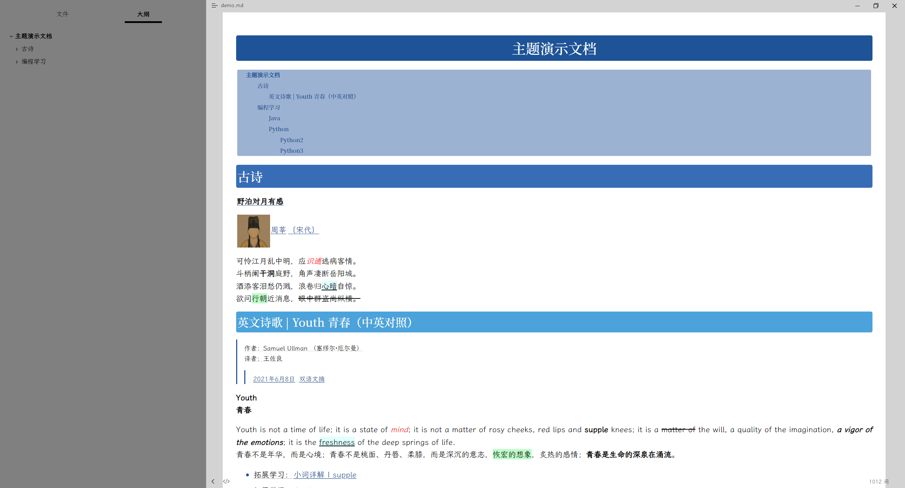
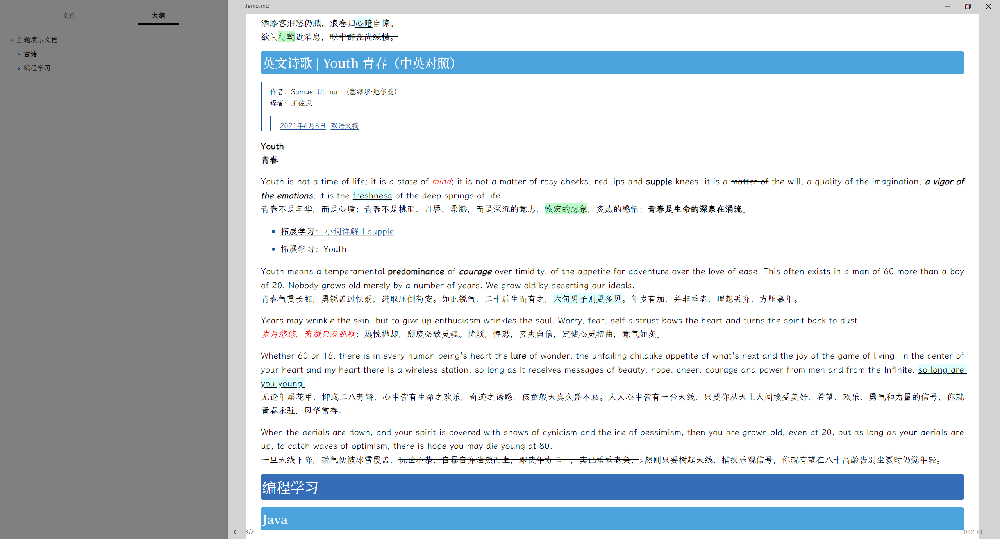
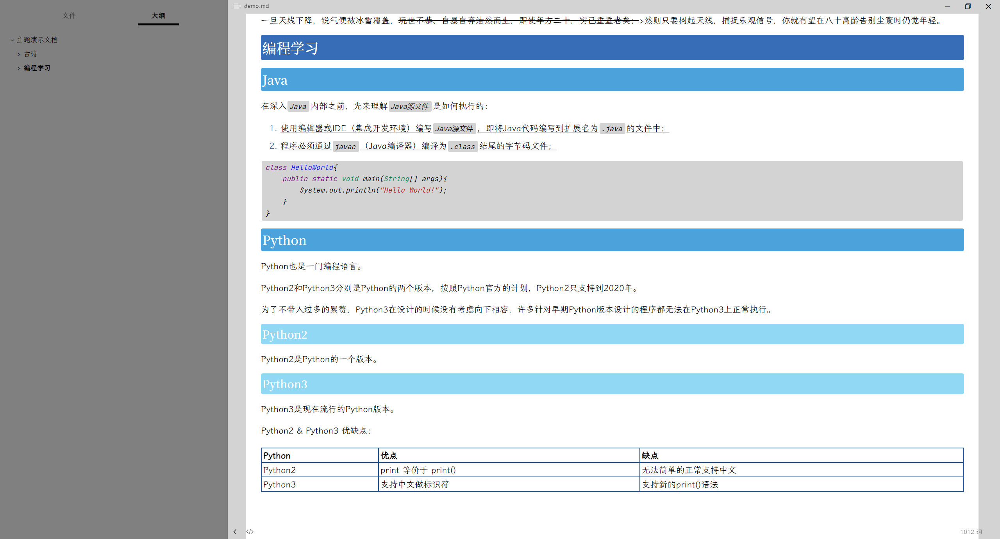

# iWonder Typora Theme

> 一个我想要的Typora主题。
>
> 一个以让文档重点更醒目为原则设计的主题。

> A Typora theme I wanted.
>
> A theme designed to sharpen the focus of the document.

## 注意事项 / Attention

> iWonder主题仅在Windows系统下做过测试, 无法确定Linux和Mac下效果。
>
> iWonder主题持续更新中。

> The iWonder theme has only been tested on Windows systems and cannot determine its effectiveness on Linux and Mac.
>
> The iWonder theme is constantly being updated.

## 私人订制 / DIY

> 通过修改`iWonder > colorScheme > default.css` 和 `iWonder > fontScheme > default.css`中的配置项，可以任意修改本主题的字体和颜色。
>
> 进阶：定制多个主题并存。
>
> 示例：假设，我想要修改一套红色，宋体字体的主题，那么我可以：
>
> 1. 复制`iWonder > colorScheme > default.css`并将之重命名为`red.css`, 修改其中的颜色为红色系列。
>
> 2. 复制`iWonder > fontScheme > default.css`并将之重命名为`song.css`, 修改其中的字体为宋体。
>
> 3. 复制`i-w-blue.css`并将之重命名为`i-w-red.css`, 
>
>    修改其中`@import url("iWonder/colorScheme/default.css");`文本为`@import url("iWonder/colorScheme/red.css")`,
>
>    修改其中`@import url("iWonder/fontScheme/default.css");`文本为`@import url("iWonder/fontScheme/song.css")`。
>
> 4. Typora中切换名为`IWRed`的主题。

> You can modify the font and color of this theme arbitrarily by modifying the configuration items in `iWonder > colorScheme > default.css` and `Font > fontScheme > default.css`.
>
> Advanced: customize the coexistence of multiple themes.
>
> Example: suppose I want to change the theme of a set of red and song font, then I can:
>
> 1. Copy `red > colorScheme > default.css` and rename it to `red.css`, and change the color to red series.
>
> 2. Copy `iWonder > fontScheme > default.css` and rename it `song.css`, and change the font to Song font.
>
> 3. Copy `i-w-blue.css` and rename it `imurwred.css`.
>
>    Modify `@ import url ("iWonder/colorScheme/default.css");` text to `@ import url ("iWonder/colorScheme/red.css")`.
>
>    Modify `@ import url ("iWonder/fontScheme/default.css");` text to `@ import url ("iWonder/fontScheme/song.css")`.
>
> 4. Switch the Typora theme named `IWRed`.

## 安装方式 / Install

> 1. [点击此处下载。](https://github.com/ReidLv/theme.typora.iWonder/releases/latest)
> 2. 解压安装包，将安装包中所有内容粘贴到主题目录。主题目录可通过`Typora > 菜单 > 主题 > 打开主题文件夹`打开。
> 3. Typora中切换主题(主题名格式：`IWxxxx`)。

> 1. [DownLoad.](https://github.com/ReidLv/theme.typora.iWonder/releases/latest)
> 2. Unzip and paste everything in the installation package into the theme folder. The theme folder can be opened from`Typora > menu> themes > open themes folder`.
> 3. Switch Typora theme. (theme name format：`IWxxxx`).

## 预览 / Preview

